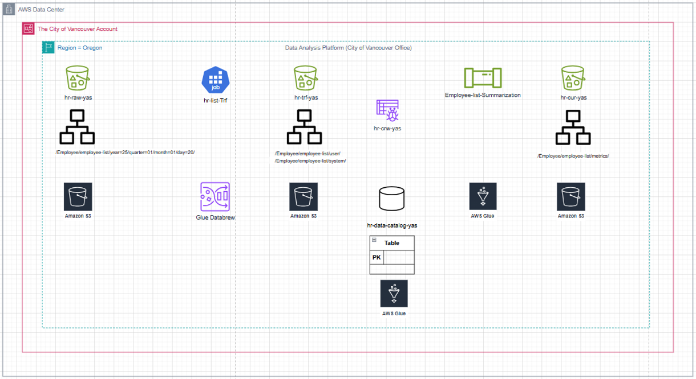
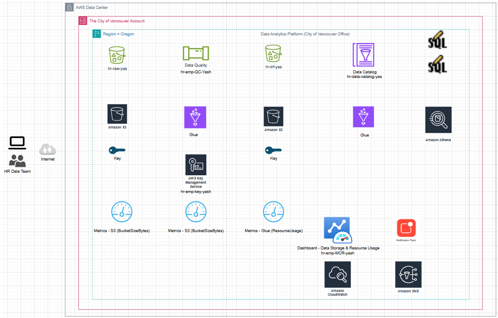

# 📊 AWS Data Analytics Platform: Employee Remuneration & Expense Analysis 

This project demonstrates an end-to-end **Data Analytics Platform (DAP)** implementation using AWS Cloud services to analyze public employee remuneration datasets from the [City of Vancouver Open Data Portal](https://opendata.vancouver.ca/pages/home/).

---

## 🚀 Project Summary

### 📘 Phase 1: Core Data Engineering Implementation

In this phase, the goal was to build a foundational data analytics platform using serverless AWS services:

- **Data Ingestion**: Raw CSV files were uploaded to S3.
- **Data Profiling**: AWS Glue DataBrew was used to identify missing values, outliers, and abnormal distributions.
- **Data Cleaning**: DataBrew cleaning recipes were created to rename columns and validate data formatting.
- **Data Transformation**: Cleaned and profiled data was exported in both CSV and Parquet formats with Snappy compression.
- **Data Cataloging**: AWS Glue Crawlers were used to scan data and register schema into the Glue Data Catalog.
- **Data Summarization**: AWS Glue ETL jobs created aggregated reports with metrics like average, min, max remuneration, and expense statistics by year.
- **Output Storage**: Summarized results were stored in curated S3 buckets in both user-readable and system formats.

### 📘 Phase 2: Data Analysis, Security, Governance & Monitoring

This phase extends the platform by introducing governance, security, and monitoring capabilities:

- **Data Analysis with SQL (Athena)**:
  - Executed business queries on remuneration and expense datasets.
  - Queried metrics like average/min/max remuneration and categorized results by job title.
- **Data Security with AWS KMS**:
  - Configured custom KMS key to encrypt/decrypt S3 data buckets.
  - Ensured fine-grained control over data access and protection.
- **Data Governance**:
  - Performed automated data quality checks using AWS Glue Data Quality.
  - Classified data into Pass/Fail categories based on completeness thresholds.
- **Data Monitoring**:
  - Implemented CloudWatch dashboards for bucket size and job runtime metrics.
  - Setup alarms with SNS notifications to alert on S3 storage thresholds.

---

## 📐 Architecture Diagrams

**Phase 1: Core Data Pipeline**

**Phase 2: Data Security, Governance & Monitoring Enhancements**

---

## 🔑 Key Concepts & Techniques Covered

- **Exploratory Data Analysis (EDA)**: Profiled raw datasets using AWS Glue DataBrew.
- **Descriptive Analysis**: Year-wise aggregation and statistical summaries.
- **Diagnostic Analysis**: Analyzed variations in remuneration and expenses.
- **Data Wrangling**: Column standardization, type conversion, partitioning.
- **Data Quality Control**: Glue-based quality checks and classification.
- **Data Security**: Encryption with AWS KMS for S3 bucket data.
- **Data Governance**: Rule-based completeness checks and transformation logic.
- **SQL-based Analysis**: Business queries with AWS Athena.
- **Cloud Monitoring**: Dashboards and alarms via AWS CloudWatch and SNS.

---

## 📦 Output Summary

| Stage | Format | Destination |
|-------|--------|-------------|
| Cleaned Data | CSV / Parquet | S3 Transform Bucket |
| Summarized Reports | CSV / Parquet | S3 Curated Bucket |
| SQL Query Results | CSV | S3 Curated Results Folder |
| Quality Results | Pass/Fail CSV | S3 QC Folder |

---

## 👨‍💻 Author
**Yashesh Bhatt**  
Cloud Analytics Practitioner | MBA Candidate | Technical Manager (Quality & Automation)

